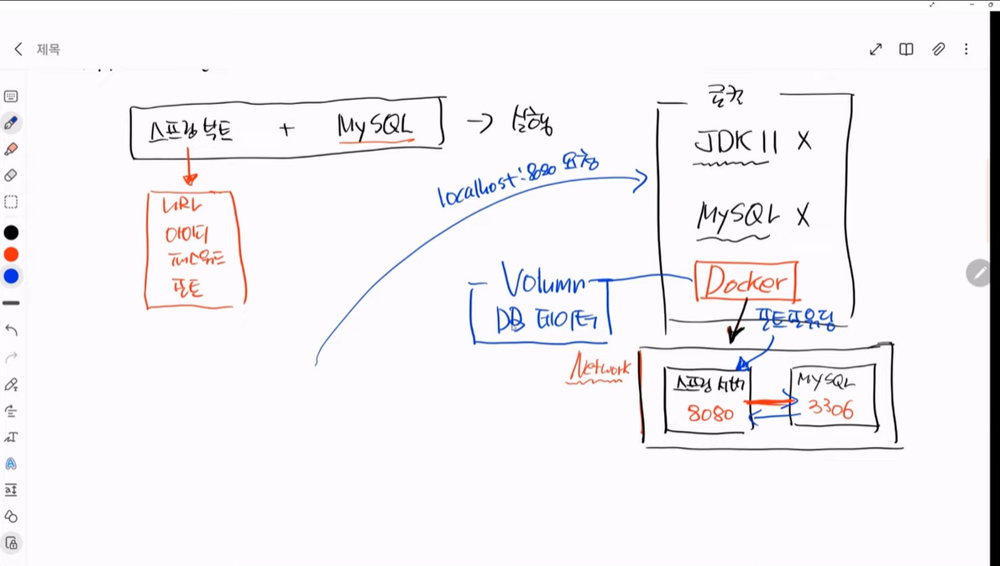

# 0210 TIL

---

## 도커 컴포즈
### 도커 컴포즈란?

`도커 컴포즈`는 단일 서버에서 여러 개의 컨테이너를 하나의 서비스로 정의해 컨테이너의 묶음으로 관리할 수 있는 작업 환경을 제공하는 관리 도구이다. 쉽게 말해 여러개의 컨테이너를 생성해 사용하던 방식을 하나의 서비스 환경으로 묶어 편하게 관리할 수 있도록 제공되는 서비스이다.

### 사용 이유

여러 개의 컨테이너가 하나의 애플리케이션으로 동작할 때 `도커 컴포즈`를 사용하지 않는다면, 이를 테스트 하려면 각 컨테이너를 하나씩 생성해야 한다. 예를 들어 웹 애플리케이션을 테스트 하려면 웹 서버 컨테이너, 데이터베이스 컨테이너 두 개의 컨테이너를 각각 생성해서 테스트 해야한다.

단순히 환경을 구축하기 위해 각각의 컨테이너를 여러 개 생성할 수 있지만 각 컨테이너가 제대로 동작하는지 확인하는 단계에서는 일일히 여러개의 컨테이너를 실행하기는 번거로울 수 있다.

`도커 컴포즈`는 여러 개의 컨테이너의 옵션롸 환경을 정의한 파일을 읽어 컨테이너를 순차적으로 생성하는 방식으로 동작한다. 도커 컴포즈의 설정 파일은 도커 엔진의 run 명령어의 옵션을 그대로 사용할 수 있으며, 각 컨테이너의 의존성, 네트워크, 볼륨 등을 함께 정의할 수도 있다.

