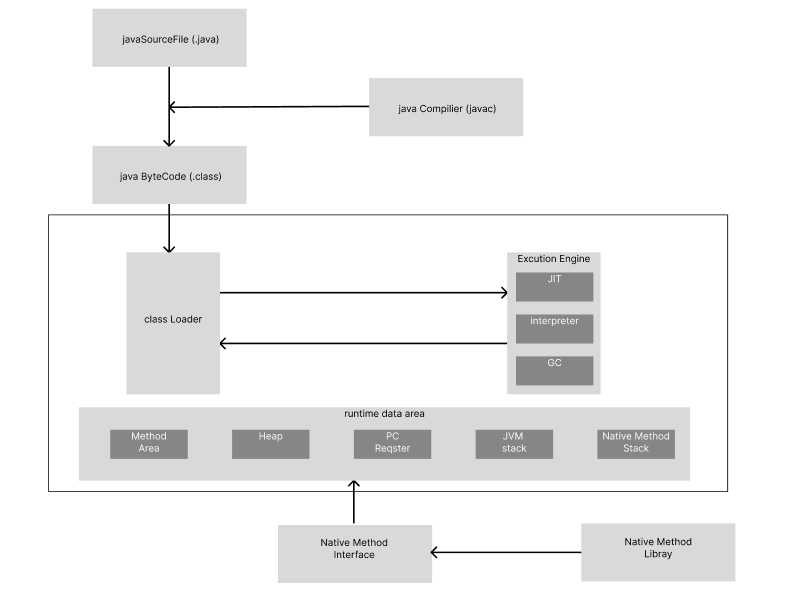
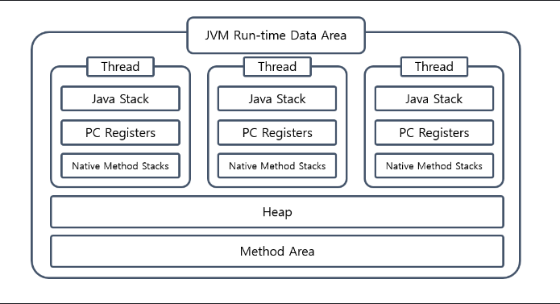
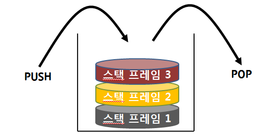

# 0222 TIL

---

## JVM 메모리 구조(Runtime Data Area)
## 개요

메모리 영역에서는 자바 프로그램을 실행하는 동안 데이터를 저장하고 관리한다. 프로그램의 실행 시간(Runtime) 동안 필요한 데이터를 보관하고 관리하는 영역이라는 의미에서 **Runtime Data Area**라고 부른다.

**JVM의 Runtime Data Area에는 크게 Method Area, Heap, pc Regster, Java Stack, Native Method Stack**이 존재한다. 각각의 영역에 대한 세부적인 역할을 알아보자

   
출처 : https://tecoble.techcourse.co.kr/post/2021-08-09-jvm-memory/
## 메서드 영역 (Method Area)

메서드 영역은 실행 중인 프로그램의 **메서드**와 **클래스 정보**를 저장하는 역할을 맡고 있다.
자세히 설명하자면 클래스 로더에 의해 로드된 **바이트 코드(.clss)**, **인터페이스에 대한 Runtime Constant Pool**, 메서드 & 필드 정보 등을 보관한다.

이 영역은 **JVM이 실행될 때 생성되며 **JVM당 하나만 생성**된다. 인스턴스 생성에 필요한 정보도 이 영역에 존재하기 때문에 JVM의 모든 Thread들이 메서드 영역을 공유하게 된다. 그리고 저장된 정보들은 JVM 종료 시점까지 유지된다.

> JVM의 다른 영역에서 해당 정보에 대한 필요한 요청이 오면, 메서드 영역 쪽에서 실제 물리 메모리 주소로 변환해 전달해 준다.

### Runtime Constant pool
Runtime Constant pool은 메서드 영역에 존재하는 별도의 관리 영역이다.
각 클래스/인터페이스 마다 별도의 **constant pool**이 존재하는데 이것은 컴파일 시 클래스 파일 내부에 존재하는 것을 확인할 수 있다. constant pool은 클래스/인터페이스 참조, 문자열, 상수 데이터 등을 저장하고 있다.

> javap -v MovieProcessor.java

직접 파일을 까서 확인해보았다.
```java
"MovieProcessor.java"
Constant pool:
   #1 = Methodref          #2.#3(참조 인덱스)          // java/lang/Object."<init>":()V
   #2 = Class(클래스)              #4             // java/lang/Object
   #3 = NameAndType(이름&타입)        #5:#6          // "<init>":()V
   #4 = Utf8(필드이름)               java/lang/Object
   #5 = Utf8               <init>
   #6 = Utf8               ()V
   #7 = Methodref          #8.#9          // config/MovieConfig.getInstance:()Lconfig/MovieConfig;
   #8 = Class              #10            // config/MovieConfig
   #9 = NameAndType        #11:#12        // getInstance:()Lconfig/MovieConfig;
  #10 = Utf8               config/MovieConfig
  #11 = Utf8               getInstance
  #12 = Utf8               ()Lconfig/MovieConfig;
  #13 = Methodref          #8.#14         // config/MovieConfig.movieOperationController:()Lcontroller/MovieOperationController;
  #14 = NameAndType        #15:#16        // movieOperationController:()Lcontroller/MovieOperationController;
 // ... 이하 생략
```
이 정보들이 런타임 시점에 Runtime Constant Pool에 저장되고, JVM은 해당 영역에서 메서드나 필드의 실제 메모리 주소를 찾아 참조한다.

## 힙 영역(Heap Area)

힙 영역은 **런타임 시점에 동적으로 할당된 '모든 객체'와 '배열'을 저장하며 '객체의 생명주기를 관리'하는 메모리 공간을 의미한다.** 힙 영역은 메서드 영역과 마찬가지로 모든 쓰레드가 함께 공유한다.(JVM당 하나만 생성됨)

> 동적으로 할당한다는 말의 의미는 new 연산자를 사용해 인스턴스를 생성하거나 배열의 크기를 지정해 힙 메모리에 저장하는 것을 말한다.

힙 영역에 생성된 객체와 배열은 참조타입(Reperence Type)으로, JVM 스택 영역에 저장된 변수나 다른 객체의 필드에서 참조하게 된다.

> 스택 영역에서 힙을 참조하므로 힙의 참조 주소는 스택 영역에서 가지고 있다.

또한 해당 영역에서 더이상 참조되지 않는 인스턴스 & 배열이 존재하게 된다면(사용되지 않는 상태) 가비지 컬렉터에 의해 쓰레기로 분류되고 힙 영역에서 자동으로 제거되게 된다.

### 정리
- 힙 영역은 런타임 시점에 생성된다.
- 힙 영역에는 동적으로 할당되는 객체와 배열등의 참조 타입이 저장된다.
- 참조 주소는 스택영역에서 가지고 있다.
- GC 대상이다.

## 스택 영역(Stack Area)

스택 영역은 Heap 영역에 생성된 참조 타입의 데이터의 참조값이 할당되고, 이외에도 기본 자료형 타입의 데이터 등의 정보들이 저장된다. 기본 자료형 데이터들에 대해서는 참조값을 저장하는 것이 아닌 실제 값이 스택 영역에 직접 저장된다.

> 스택 영역에 있는 변수들은 가시성(visibility)를 가지는데, 이는 변수의 유효 범위(scope)에 대한 개념으로 전역변수가 아닌 지역변수가 함수 내에서 스택에 할당된 경우 그 지역변수는 다른 함수에서 접근할 수 없다.

또한 스택 영역은 각 Thread 별로 따로 할당되는 영역이다. 스레스 하나가 생성되는 순간 해당 스레드를 위한 스택 영역도 함께 생성되어 메모리가 따로 할당되고, 개별 스레드 간 스택 영역에 접근할 수 없어 동시성 문제에서도 자유롭다.

### 스택 프레임(Stack Frame)

스택 프레임은 스택 영역에 차례대로 저장되는 메서드의 호출 정보로 메서드가 호출 될 때마다 그 메서드만을 위한 스택 프레임이 생성되고 스택 프레임 안에 메서드 안에서 사용되는 매개변수, 지역 변수 리턴값 등이 저장된다. 그리고 그 스택 프레임은 LIFO(후입선출) 구조로 스택 영역에 쌓여 메서드 호출 범위가 종료될 때 프레임 별로 스택 영역에서 제거된다.

   
출처 : https://inpa.tistory.com

## PC 레지스터(Program Counter Register)

pc레지스터는 각 스레드마다 **현재 실행 중인 또는 다음에 실행할 JVM 명령어의 주소**를 저장하는 메모리 공간이다. 각 스레드에서는 명령을 실행하기 위해 PC레지스터를 통해 명령어의 주소를 참조한다.

여러 스레드가 동시에 실행되는 환경에서 각 스레드는 다음에 실행할 명령어의 주소값을 알고 있어야 하는데 PC 레지스터는 현재 실행 중인 스레드의 명령어 주소를 추적함으로써 프로그램의 흐름을 제어할 수 있고, 각 스레드 별로 다음에 실행할 명령어를 정확하게 파악할 수 있어 동시 실행의 보장을 돕는다.
## 네이티브 메서드 스택(Native Method Stack)

네이티브 메서드 스택 영역은 자바 코드가 컴파일 되어 생성되는 바이트 코드가 아닌 **기계어로 작성된 프로그램 및 자바 이외의 언어로 작성된 네이티브 코드**를 실행하는 영역이다.
**JIT 컴파일러**에 의해 변환된 네이티브 코드 역시 해당 영역에서 실행이 된다. 스택 영역 같이 이 영역에도 스택 프레임으로 저장되는 데이터가 관리되고, 네이티브 메서드 호출시 스택 프레임이 생성되고 메소드 실행 완료 시점에 프레임이 제거된다.

> 일반적으로 메서드 실행 시점에 스택 영역에 데이터가 쌓이다가 해당 메서드 내부에 네이티브 방식을 사용하는 메서드가 있다면 그 메서드는 네이티브 스택 영역에 쌓이게 된다.
> 그리고 해당 네이티브 메서드 수행이 끝나는 시점에 다시 자바 스택 영역으로 돌아와 작업을 수행한다.
> **이러한 방식 덕분에 네이티브 코드로 되어 있는 함수의 호출을 자바 프로그램 내에서도 직접 수행할 수 있고, 결과를 받을 수도 있다고 한다.**

---
https://inpa.tistory.com/entry/JAVA-%E2%98%95-JVM-%EB%82%B4%EB%B6%80-%EA%B5%AC%EC%A1%B0-%EB%A9%94%EB%AA%A8%EB%A6%AC-%EC%98%81%EC%97%AD-%EC%8B%AC%ED%99%94%ED%8E%B8#%EB%9F%B0%ED%83%80%EC%9E%84_%EB%8D%B0%EC%9D%B4%ED%84%B0_%EC%98%81%EC%97%AD_runtime_data_area

https://tecoble.techcourse.co.kr/post/2021-08-09-jvm-memory/

https://www.tcpschool.com/c/c_memory_stackframe#google_vignette