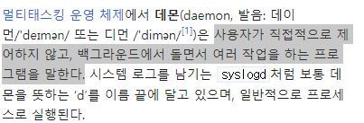
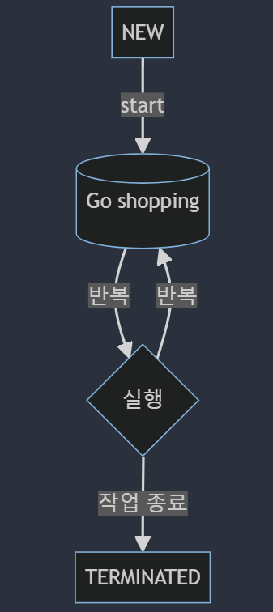
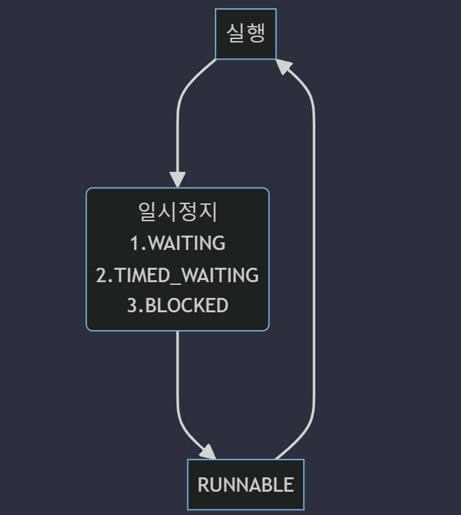

# 0228TIL

---
## 스레드 우선순위

멀티스레드의 순서를 정하는 것을 스레드 스케줄링(thread scheduling)이라고 한다. 스레드 스케줄링 방식에는 **우선순위(priority)방식**과 **순환 할당(Round-Robin)방식**이 있습니다.

#### 우선순위 방식
우선 순위 방식은 **우선순위가 높은 스레드가 실행 상태를 더 많이 가지도록 스케줄링 하는 것**을 말하며 setPriority()메소드를 사용하여 우선순위를 설정한다,

#### 순환 할당 방식
순환 할당방식은 **시간 할당량(Time Slice)**을 정해서 하나의 스레드를 정해진 시간만큼 실행하고 다시 다른 스레드를 실행하는 방식이다. 우선순위 방식은 스레드 객체에 우선순위를 부여하기 때문에 개발자가 코드를 제어할 수 있지만, 순환 할당 방식은 JVM에 의해 이루어지기 때문에 코드로 제어할 수 없다.

```java
public final void setPriority(int newPriority) { // 스레드 우선순위를 지정한 값으로 변
    ThreadGroup g;  
    checkAccess();  
    if (newPriority > MAX_PRIORITY || newPriority < MIN_PRIORITY) {  
        throw new IllegalArgumentException();  
    }  
    if((g = getThreadGroup()) != null) {  
        if (newPriority > g.getMaxPriority()) {  
            newPriority = g.getMaxPriority();  
        }  
        setPriority0(priority = newPriority);  
    }  
}

public final int getPriority() {  // 스레드 우선순위를 반환
    return priority;  
}

/**  
 * The minimum priority that a thread can have. 최소우선순위
 */
 public static final int MIN_PRIORITY = 1;  
  
/**  
 * The default priority that is assigned to a thread. 기본우선순위
 */
 public static final int NORM_PRIORITY = 5;  
  
/**  
 * The maximum priority that a thread can have. 최대우선순
 */
 public static final int MAX_PRIORITY = 10;
```

스레드의 우선순위가 같은 경우 OS 스케줄러에 의해 동일한 작업 시간을 할당받는다. 하지만 **우선순위가 높은 경우 높은 우선순위의 스레드가 작업시간을 더 많이 할당받게 된다.**

> 스레드의 우선순위와 실제 OS스케줄러의 우선순위는 다르다. OS스케줄러는 실행 중인 모든 프로그램을 관리하고 있기 때문에 JVM에서 우선순위를 정해도 그에 맞게 실행되지 않는 것이 정확하다.
> 쉽게 말하면 JVM으로 인해 정해진 스레드의 우선순위를 OS스케줄러가 참고해 작업을 제어하게 된다고 생각하자.


## 스레드 그룹

스레드 그룹(Thread Group)은 관련된 스레드들을 관련성 있게 묶어서 한 번에 관리하고, 스레드들의 특성을 일괄적으로 제어하기 위해 사용된다.

모든스레드는 반드시 하나의 스레드 그룹에 포함되어 있어야 한다.

스레드 그룹을 따로 지정하지 않고 스레드를 생성했다면 그 스레드는 **main스레드 그룹**에 속한다. 그룹을 지정하지 않은 스레드는 해당 스레드를 생성한 스레드(부모 스레드)의 그룹과 우선순위를 상속받는다.

좀 더 자세히 알아보자

>**Constructs a new thread group. The parent of this new group is the thread group of the currently running thread.**
**The checkAccess method of the parent thread group is called with no arguments; this may result in a security exception.**

```
public ThreadGroup(String name) {  
    this(Thread.currentThread().getThreadGroup(), name);  
}
```

The parent of this new group is the thread group of the currently running thread. 이란 문장에서 알 수 있듯이 부모 스레드는 현재 실행 중인 스레드다. 따로 부모 스레드를 지정하지 않은 채 스레드를 생성하면 `Thread.currentThread().getThreadGroup()`로 현재 실행 중인 스레드를 가져오게 되고 **Java애플리케이션은 main스레드에서 부터 시작**되는 걸 알 수 있듯, main스레드 그룹에 속하게 되는 것이다.

```
public ThreadGroup(ThreadGroup parent, String name) {  
    this(checkParentAccess(parent), parent, name);  
}
```

위 메서드를 보면 알 수 있듯이 부모 스레드를 직접 지정해 새로운 스레드 그룹을 생성할 수도 있다.

## 데몬 스레드(Daemon thread)

데몬 스레드는 **주 스레드의 작업을 돕는 보조적인 역할을 수행**하는 스레드이다. 내가 알고 있던 데몬의 뜻은


이런 뜻인데, 자바에서 데몬 스레드도 백그라운드에서 동작하며, 주로 서비스 스레드의 보조 역할을 수행하거나 특정 작업을 주기적으로 처리하기 위한 목적으로 사용한다.

이러한 데몬 스레드는 **주 스레드가 종료되면 데몬 스레드는 강제적으로 자동 종료**된다. 주 스레드의 보조 역할을 하는 스레드이니 주 스레드가 종료되면 활성 상태여야할 이유가 없기 때문이다.

```java
public class DaemonLoggerTest {  
    public static void main(String[] args) {  
        Thread loggerThread = new Thread(new LoggerTask());  
        loggerThread.setDaemon(true); // 데몬 스레드로 설정  
        loggerThread.start();  
  
        // 메인 스레드는 여기서 다른 작업을 수행할 수 있음  
        try {  
            Thread.sleep(8000); // 메인 스레드를 5초간 대기시킴(종료방지)  
        } catch (InterruptedException e) {  
            e.printStackTrace();  
        }  
  
        System.out.println("프로그램 종료");  
    }  
}  
  
class LoggerTask implements Runnable {  
    @Override  
    public void run() {  
        while (true) {  
            logMessage("Logging message at: " + new Date());  
            try {  
                Thread.sleep(1000); // 2초마다 로그 기록  
            } catch (InterruptedException e) {  
                e.printStackTrace();  
            }  
        }  
    }  
  
    private void logMessage(String message) {  
        System.out.println(message);  
    }  
}
```

## 스레드의 상태

- **NEW** : 스레드가 새로 생성됨. 아직 `start()`메서드가 호출되지는 않은 상태
- **RUNNABLE** : 실행 중 또는 실행 가능한 상태
- **BLOCKED** : 동기화 블럭에 의해 일시정지된 상태(lock이 풀릴 때 까지 기다리는 상태)
- **WHITING** : 일시정지 상태(작업 종료는 아니지만 실행 가능도 아님)
- **TIMED_WAITING** : 주어진 시간동안 정지된 상태
- **TERMINATED** : 스레드의 작업이 종료된 상태



일반적으로 `start()`메서드 호출시 스레드는 실행 전 실행 대기 상태(RUNNABLE)가 되고 스레드 스케줄링으로 선택된 스레드가 실행 상태가 된다.

실행 상태의 스레드는 run() 메소드를 모두 실행하기 전에 스레드 스케줄링에 의해 다시 실행 대기 상태로 돌아가고 다른 스레드가 선택되어 실행 상태가 되는 작업을 반복한다.

더이상 실행할 코드가 없어지면 종료 상태(TERMINATED)가 된다.



경우에 따라서 스레드는 실행 상태에서 실행 대기 상태로 가지 않고, 일시 정지 상태로 가기도 한다. 스레드가 다시 실행 상태로 가기 위해서는 일시 정지 상태에서 실행 대기 상태로 가야한다.