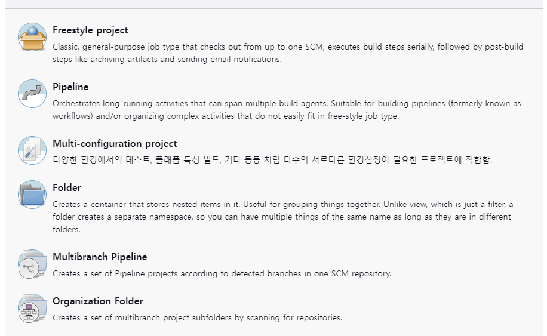

# 0305 TIL

---
# 젠킨스(Jenkins)

## 개요

젠킨스(Jenkins)는 CI/CD 도구로써 가장 많이 사용되는 오픈소스 도구 중 하나이다.
개발을 진행하면서 겪게되는 빌드 / 테스트 / 배포 등의  생성주기를 커버하고 있고, 언어 및 프레임워크에 상관없이 젠킨스를 적용할 수 있다.
또한 무려 1800개가 넘는 플러그인을 보유하고 있다.

## 주요 기능 및 장점

##### 편리한 설치 방법
- 싱글 바이너리(jenkins.war) 기반 실행
- 자바가 실행될 수 있는 환경에서는 어디든 실행 가능(자바 11, 17 지원)
- NO Db required -> jenkins_home위치에 xml 형태로 기록됨(재부팅시 xml파일 읽어서 상태 복원)

##### 직관적 UI
- 기본적인 기능은 별도 학습 없이 사용 가능
- 대부분의 기능이 기대하는 위치에 존재

##### 풍부한 API
- 모든 페이지는 해당 페이지에 대응하는 API 제공
    - 모든 페이지 방문시 해당 페이지 url path에 /api 만 넣어주면 어떤 api가 제공가능한지 설명 문서 제공

##### 강력한 실행 트리거 기능
- crontab expression 지원
    - 매분 매시간 마다 특정 작업을 실행하도록 제어 가능
    - github pr시마다 훅 호출 설정시 훅 기반으로 작업하도록 제어 가능

##### 다양한 SCM 지원
- git뿐만 아니라 대부분의 SCM 사용 가능

##### Pipeline 지원
- jenkinsfile 이라는 DSL 스크립트를 사용해 빌드 스탭을 코드로 관리 가능
    - groovy 언어를 사용해 스크립트를 작성하기 때문에 빌드 스크립트에 각종 조건문 추가 및 동적으로 빌드 과정 제어 가능

##### 멀티 노드 지원
- 빌드 부하 분산 또는 다양한 빌드 환경 지원을 위한 다수개의 빌드 에이전트 연동 가능
    - 여러 OS에서 빌드해야하는 경우가 존재(OS별 바이너리를 만들기 위해 OS별로 빌드 필요)
    - 젠킨스의 마스터 에이전트 구조를 활용해 해결 가능
    - 젠킨스의 마스터에서 빌드 설정 -> 각 빌드가 타겟팅하는 시스템에 따라 각각 다른 OS에 설치된 에이전트에서 빌드
    - 젠킨스가 수십개의 프로젝트를 담당하는 경우 성능 저하를 방지하기 위해 다수개의 빌드 에이전트를 연동해 부하 분산 가

##### Multi Configuration 프로젝트 지원
- 하나의 프로젝트를 다양한 환경 구성에 따라 복수 번 빌드 가능
    - 한개의 Multi Configuration Build Job 설정 할 때 Configuration을 여러 개 정의해 두고 이를 실행하는 것만으로 각 Configuration별로 빌드가 실행되고 각 빌드 별로 다른 실행 결과에 따른 결과정보를 수집 가능

##### 다양한 권한 / 인증 설정
- Github Oauth / LDAP 등

##### 정교한 플러그인 확장 구조
- 다양한 확장 포인트 제공
- 재부팅 불필요(플러그인 적용을 위해 재부팅할 필요 없이 바로 적용)

## 주요 활용처 - 빌드 / 배포

젠킨스는 CI/CD를 위한 빌드 배포 자동화에 사용된다.
젠킨스는 `Job`이라는 단위를 사용해 반복 수행될 각각의 작업을 정의한다.

각 작업은 작업의 타입에 따라서 다르긴 하지만 가장 기본적인 Freestyle Job의 경우
- **소스코드 관리**
    - GIT / SVN 등의 소스 위치를 지정
- **빌드 유발**
    - 언제 빌드를 시작할지 지정
    - 특정 시간 또는 변경 발생(pr) 시 소스코드 체크아웃
- **빌드 스텝**
    - 빌드 수행(+배포 수행)
    - 스크립트 활용해 작성 가능
    - 외부 도구 연결 가능
- **빌드 후 조치**
    - 빌드 결과 가시화, 분석 결과 전달
      총 4가지 스텝으로 이루어 진다.

## 배치 관리 용도

젠킨스는 강력한 빌드 트리거링 방법을 제공하고 있다. 이를 통해 특정 스크립트를 특정 시간에 실행시키도록 제어할 수 있다. 따라서 젠킨스는 배치 작업을 관리하고 이를 실행하는 용도로도 사용이 가능하다.

## Job 타입

Jenkins의 Job 타입에 대해서도 간단하게 알아보았다.

#### Freestyle project

`Freestyle project`는 Jenkins에 대한 깊은 지식 없이도 간단하고 자유롭게 빌드 설정이 가능하다.
- 간단한 빌드 / 배포 JOB 구성 시 활용
- 배치 트리거로 사용

#### Pipeline
`Pipeline`은 텍스트 기반 스크립트(Jenkinsfile)를 사용해 빌드를 실행한다. Jenkinsfile을 직접 Job 설정 화면에 기록하거나 SCM을 통해 가져올 수 있다. 형상관리가 함께 가능하다는 장점이 있다.
- github repo에 jenkinsfile을 위치시키고 빌드 수행하는 방식으로 사용 가능

#### Multi-configuration project
`Multi-configuration project`은 `Freestyle project`의 확장판이다. 다양한 변수 및 조건 설정이 가능하고 빌드 실행 시 설정된 조건의 조합 만큼 반복 실행이 가능하다. 이러한 기능 때문에 다양한 환경 조건 하에서 테스트 하기 쉽다는 장점이 있다.

#### Folder
여러 개의 Job을 묶어서 관리하는 폴더 기능
job을 폴더로 묶어서 사용하면 다른 곳에서 사용하는 job에 의한 충돌이 발생하지 않는다.

#### Multi Branch Pipeline
`Multi Branch Pipeline`은 최근 jenkins 측에서 권장하고 있는 job 타입이다. SCM의 여러 브랜치들을 동시에 pipeline 빌드를 하는 경우에 사용된다.
- Git flow 전략을 사용하는 경우 처럼 여러 브랜치를 동시 운영하는 경우(PR포함) 적
- `Multi Branch Pipeline`의 설정 하나만으로 각 브랜치를 sub pipeline으로 관리 & 실행하기 때문에 간편하다.
- 빌드가 반드시 Jenkinsfile 형식으로만 이루어지기 때문에 공부가 필요함

#### Organization Folder
`Multi Branch Pipeline`을 github organization 레벨로 확장

## FreeStyle Project(Job)
FreeStyle Project의 설정 사항은 크게 5가지로 구분된다.

#### 소스코드 관리
- 어떤 코드와 브랜치를 감지하고 어떻게 체크하웃 할 것인지 지정
    - A github repo를 hello/ 폴더에 체크아웃
    - B github repo 중 src 폴더만 체크아웃

#### 빌드 유발
- 빌드를 시작하는 방법을 지정
    - 월요일 밤 12시에 시작
    - 매 분마다 한번씩 repo를 체크해 변경이 있으면 빌드(Poll SCM)
    - 다른 job이 빌드 완료되면 빌드 시작
    - 원격에서 API 호출로 빌드 시작
    - github PR시 빌드 시작(플러그인 확장)

#### 빌드 환경
- 빌드 전 필요한 설정 지정
    - 빌드 시작 전 workspace 삭제

#### 빌드 스탭
- 실제 빌드 스크립트 실행
    - 빌드 명령 실행
    - 소스 코드 빌드
    - docker 이미지 생성
    - SonarScanner 연동(코드 품질 분석 검증)
    - ArgoCd 실행(빌드된 docker 이미지 쿠버네티스에 배포)

#### 빌드 후 조치
- 빌드 이후 빌드 결과물을 처리
    - Artifact 아카이빙
    - 테스트 결과 / 테스트 커버리지 등 가시화
    - 빌드 결과에 브랜치 상태 포함
    - Slack / 이메일로 빌드 결과 전송
    - 다른 Job 실행