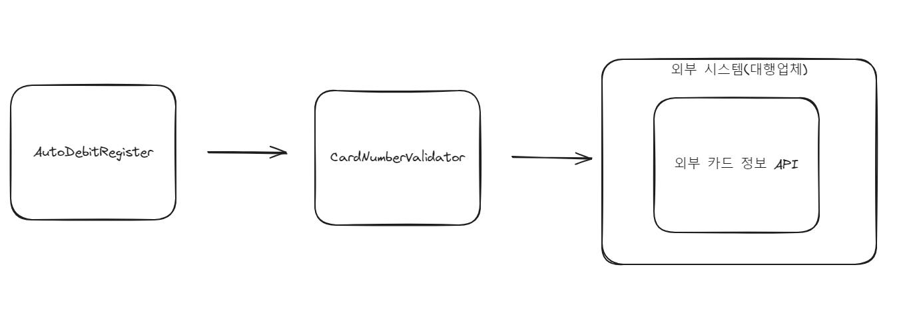

# 대역을 사용한 테스트
## 대역의 필요성

테스트를 작성하다 보면 외부 요인이 필요한 시점이 있다.
다음은 외부 요인이 테스트에 관여하는 주요 예이다.


- 테스트 대상에서 파일 시스템을 사용
- 테스트 대상에서 DB로부터 데이터를 조회하거나 데이터를 추가
- 테스트 대상에서 외부의 HTTP 서버와 통신

**테스트 대상이 외부 요인에 의존하면 테스트를 작성하고 실행하기 어려워진다.**
대상 코드에서 사용하는 외부 API 서버가 일시적으로 장애가 나거나 내부 사용 DB 데이터를 상황에 맞게 구성하는 것이 항상 가능하지도 않다.

테스트 대상에서 의존하는 요인 때문에 테스트가 어려운 경우 대역을 사용해 테스트를 진행할 수도 있다.

## 대역을 이용한 테스트



`AutoDebitReguster`클래스는 자동이체 등록 기능을 구현했고 `CardNumberValidator`클래스는 외부 API를 활용해 카드 번호가 유효한지 확인한다. `AutoDebitReguster`는 `CardNumberValidator`를 이용해 카드 번호가 유효한지 검사 후 결과에 따라 자동이체 정보를 저장한다.

```java
public class AutoDebitRegister {
    private CardNumberValidator validator;
    private AutoDebitInfoRepository repository;

    public AutoDebitRegister(CardNumberValidator validator, AutoDebitInfoRepository repository) {
        this.validator = validator;
        this.repository = repository;
    }

    public RegisterResult register(AutoDebitReq req) {
        CardValidity validity = validator.validate(req.getCardNumber());
        if (validity != CardValidity.VALID) {
            return RegisterResult.error(validity);
        }
        AutoDebitInfo info = repository.findOne(req.getUserId());
        if (info != null) {
            info.changeCardNumber(req.getCardNumber());
        } else {
            AutoDebitInfo newInfo = new AutoDebitInfo(req.getUserId(), req.getCardNumber(), LocalDateTime.now());
            repository.save(newInfo);
        }
        return RegisterResult.success();
    }
}
```

```java
public class CardNumberValidator {  
    public CardValidity validate(String cardNumber) {  
        HttpClient httpClient = HttpClient.newHttpClient();  
        HttpRequest request = HttpRequest.newBuilder()  
                .uri(URI.create("https://some-external-pg.com/card")) // 가상 uri 
                .header("Content-Type", "text/plain")  
                .POST(HttpRequest.BodyPublishers.ofString(cardNumber))  
                .build();  
        try {  
            HttpResponse<String> response = httpClient.send(request, HttpResponse.BodyHandlers.ofString());  
            switch (response.body()) {  
                case "ok": return CardValidity.VALID;  
                case "bad": return CardValidity.INVALID;  
                case "expired": return CardValidity.EXPIRED;  
                case "theft": return CardValidity.THEFT;  
                default: return CardValidity.UNKNOWN;  
            }  
        } catch (IOException | InterruptedException e) {  
            return CardValidity.ERROR;  
        }  
    }  
}
```

```java
public class AutoDebitRegisterTest {  
    private AutoDebitRegister register;  
  
    @BeforeEach  
    void setUp() {  
        CardNumberValidator validator = new CardNumberValidator();  
        AutoDebitInfoRepository repository = new JpaAutoDebitInfoRepository();  
        register = new AutoDebitRegister(validator, repository);  
    }  
  
    @Test  
    void validCard() {  
        // 외부에서 테스트용으로 받은 유효한 카드번호 사용  
        AutoDebitReq request = new AutoDebitReq("user1", "1234123412341234");  
        RegisterResult result = this.register.register(request);  
  
        assertEquals(CardValidity.VALID, result.getValidity());  
    }  
    @Test  
    void theftCard() {  
        // 외부에서 받은 도난 테스트용 카드번호 사용  
        AutoDebitReq request = new AutoDebitReq("user1", "1234567890123456");  
        RegisterResult result = this.register.register(request);  
  
        assertEquals(CardValidity.VALID, result.getValidity());  
    }  
}
```

해당 테스트의 카드번호는 외부 업체에서 제공 받고 검증된다는 가정하에 작성했다.
`validCard()`테스트의 경우 받은 카드번호가 만료될 경우 만료 시점부터 테스트는 실패하게 된다.
`theftCard()`테스트의 경우 도난 카드 정보를 외부 업체에서 삭제하는 경우 그 시점부터 테스트가 실패하게 된다.

해당 경우는 외부 업체가 개발 환경을 제공했다는 가정 하에 작성된 것이므로 만약 외부 서비스의 협조가 원활하지 않은 경우 테스트는 더욱 힘들어진다.

그렇다면 외부 요인을 대신하는 대역을 사용해 테스트를 진행해보자

```java
public class StubCardNumberValidator extends CardNumberValidator {  
    private String invalidNo;
  
    public void setInvalidNo(String invalidNo) {  
        this.invalidNo = invalidNo;  
    }  
  
    @Override  
    public CardValidity validate(String cardNumber) {  
        if(invalidNo != null && invalidNo.equals(cardNumber)) { // 카드 번호와 invalidNo가 같은지 검증  
            return CardValidity.VALID;  
        }  
        return CardValidity.VALID;  
    }  
}
```

`StubCardNumberValidator` 실제 카드 번호 검증 기능을 대체하는 클래스다.
```java
public class AutoDebitRegisterStubTest {  
    private AutoDebitRegister register;  
    private StubCardNumberValidator stubValidator;  
    private StubAutoDebitInfoRepository stubRepository;  
  
    @BeforeEach  
    void setUp() {  
        stubValidator = new StubCardNumberValidator();  
        stubRepository = new StubAutoDebitInfoRepository();  
        register = new AutoDebitRegister(stubValidator, stubRepository);  
    }  
  
    @Test  
    void invalidCard() { // 유효하지 않은 번호 검
        stubValidator.setInvalidNo("111122223333");  
  
        AutoDebitReq req = new AutoDebitReq("user1", "111122223333");  
        RegisterResult result = this.register.register(req);  
  
        assertEquals(CardValidity.VALID, result.getValidity());  
    }
}
```

다음은 대역을 이용한 테스트 코드이다. `AutoDebitRegister` 객체 생성 시 생성자로 `StubCardNumberValidator` 객체를 전달해 대역을 사용한 검증 방식으로 전환했다.

```java
public class StubCardNumberValidator extends CardNumberValidator {
//...
	private String theftNo; // 도난당한 번호
	
	public void setTheftNo(String theftNo) {  
	    this.theftNo = theftNo;  
	}
	
	@Override  
	public CardValidity validate(String cardNumber) {
	//...
	if(theftNo != null && theftNo.equals(cardNumber)) {// 카드 번호와 theftNo가 같은지 검증  
    return CardValidity.THEFT;  
}
	
	}
} // theftCard() 검증을 위한 코드 추가

@Test  
void theftCard() {
    stubValidator.setTheftNo("1234567890123456");  
  
    AutoDebitReq req = new AutoDebitReq("user1", "1234567890123456");  
    RegisterResult result = this.register.register(req);  
  
    assertEquals(CardValidity.THEFT, result.getValidity());  
}
```

도난 카드번호를 처리할 수 있는 대역을 구현해 도난 카드번호에 대한 자동이체 기능을 테스트할 수 있다.

```java
public class MemoryAutoDebitInfoRepository implements AutoDebitInfoRepository {  
  
    private Map<String, AutoDebitInfo> infoData = new HashMap<>();  
  
    @Override  
    public void save(AutoDebitInfo info) {  
        infoData.put(info.getUserId(), info);  
    }  
  
    @Override  
    public AutoDebitInfo findOne(String userId) {  
        return infoData.get(userId);  
    }  
}
```

DB 역할을 하는 클래스 또한 대역으로 만들어 테스트할 수 있다. 실제 DB 대신 Map을 이용해 자동이체 정보를 저장한다.

위 같은 대역을 설정하여
- 외부 카드 정보 API 연동
- DB에 자동이체 정보를 저장
  두 기능을 외부의 의존 없이 테스트 했다.

## 대역의 종류

- **스텁(stub)** : **구현을 단순화한 것으로 대체**한다. 테스트에 맞게 원하는 동작을 단순하게 수행한다. `StubCardMemberValidator` 가 해당된다.
- **가짜(fake)** : **제품에는 적합하지 않지만, 실제 동작하는 구현을 제공**한다. 실제 DB 대신 메모리를 이용해서 구현한 `MemoryAutoDebitInfoRepository`가 해당된다.
- **스파이(spy)** : **호출된 내역을 기록**한다. 기록한 내용은 테스트 결과를 검증할 때 사용한다.
- **모의(Mock)** : **기대한 대로 상호작용하는지 행위를 검증**한다. 기대한 대로 동작하지 않으면 예외가 발생할 수 있다. 모의 객체는 스텁이자 스파이도 된다.

간단한 회원 가입 기능을 TDD 방식으로 구현해보았다.

#### 약한 암호 검증에 스텁 대역 사용용

```java
public class UserRegisterTest {  
    private UserRegister userRegister;  
    private StubWeakPasswordChecker stubWeakPasswordChecker = new StubWeakPasswordChecker();  
  
    @BeforeEach  
    void setUp() {  
        userRegister = new UserRegister(stubWeakPasswordChecker);  
    }  
  
    @Test  
    @DisplayName("약한 암호면 가입 실패")  
    void weakPassword() {  
        stubWeakPasswordChecker.setWeak(true); // 암호가 약하다고 응답  
  
        Assertions.assertThrows(  
                WeakPasswordException.class,  
                () -> userRegister.register("id", "pw", "email")  
        );  
    }  
}
```

테스트 대상이 `UserRegister`이므로 `WeakPasswordChecker`는 대역을 사용했다. 약한 암호인지 여부만 알려주기만 하면 되므로 **간단하게 대체할 수 있는 스텁 대역을 사용**했다.

```
org.opentest4j.AssertionFailedError: Expected chap07.userRegist.WeakPasswordException to be thrown, but nothing was thrown.
```

예외 발생 여부를 테스트하는 단언문을 사용했지만 `WeakPasswordException`이 발생하지 않았으므로 실패했다고 나왔다.

```java
public class UserRegister {

	public void register(String id, String pw, String email) {  
    if(passwordChecker.checkPasswordWeak(pw)) {  
        throw new WeakPasswordException();  
    }  
}
```

```java
public class StubWeakPasswordChecker implements WeakPasswordChecker {
// ...

	@Override  
	public boolean checkPasswordWeak(String pw) {  
	    return weak;  
	}
	// ...
}
```

약한 암호인 경우 예외가 발생해야 하므로 설계 사항에 맞추어 검증되도록 구현을 일반화 했다. 테스트 과정에서 암호가 약하다는 응답을 전달헀으므로(true), 예외 발생 로직을 이에 맞춰 간단하게 구현했다.

스텁 대역을 사용해 로직 구현을 단순화 했기 때문에 테스트에 필요한 값만 사용하고 이에 맞춰서 간단한 로직만 구현해 검증을 수행했다.

#### 리포지토리를 가짜 구현으로 사용

```java
public class UserRegisterTest {

	private MemoryUserRepository fakeRepository = new MemoryUserRepository();

	@BeforeEach  
	void setUp() {  
	    userRegister = new UserRegister(stubWeakPasswordChecker, fakeRepository);  
	}

	@Test  
	@DisplayName("이미 같은 ID가 존재하면 가입 실패")  
	void dupIdExists() {  
	    fakeRepository.save(new User("id", "pw", "email"));  
  
	    assertThrows(  
	            DupIdException.class,  
	            () -> userRegister.register("id", "pw", "email")  
    );  
}  
  
	@Test  
	@DisplayName("같은 ID가 없으면 가입 성공")  
	void noDupId_RegisterSuccess() {  
	    userRegister.register("id", "pw", "email");  
	  
	    User savedUser = fakeRepository.findById("id"); // 가입 결과 확인  
	  
	    assertAll(  
	            () -> assertEquals("id", savedUser.getId()),  
	            () -> assertEquals("email", savedUser.getEmail())  
	    );  
	}
}
```

회원가입 데이터를 저장하고 중복 데이터 검증을 간편하게 테스트 하기 위해 가짜(fake) 리포지토리 객체를 만들어 테스트 했다.

```java
public class MemoryUserRepository implements UserRepository {  
  
    private Map<String, User> users = new HashMap<>();  
  
    @Override  
    public void save(User user) {  
        users.put(user.getId(), user);  
    }  
  
    @Override  
    public User findById(String id) {  
        return users.get(id);  
    }  
}
```

`HashMap`을 사용해 인메모리 DB 저장 방식을 구현해 테스트가 가능할 정도 만큼만 구현을 수행했다.

>구현 흐름은 이전 방법대로 실패 테스트를 생성한 후 특정 값(상수)를 사용해 테스트를
>통과 -> 예시 케이스를 추가하거나 바로 구현을 일반화하는 방식으로 테스트 코드를 작성했다.


#### 이메일 발송 여부를 확인하기 위해 스파이를 사용

회원 가입 성공시 이메일로 회원 가입 안내 메일을 발송하는 기능을 구현한다. 이를 위한 테스트 코드 골격이다.
```
// 실행
userRegister.register("id", "pw", "email@domain.com");

// 결과
email@domain.com 으로 이메일 발송을 요청했는지 확인
```

결과를 체크하기 위해 어떤 방법으로 이메일 발송을 요청했는지 확인할 지를 설계해야 한다.

```java
public class SpyEmailNotifier implements EmailNotifier {  
    private boolean called;  
    private String email;  
  
    public boolean isCalled() {  
        return called;  
    }  
  
    public String getEmail() {  
        return email;  
    }  
}
```

이메일 발송 여부와 발송 기능을 가지고 있는 `EmailNotifier`의 스파이 대역 객체인 `SpyEmailNotifier`를 구현했다.

```java
@Test  
@DisplayName("회원가입 완료시 이메일 전송")  
void whenRegisterThenSendMail() {  
    userRegister.register("id", "pw", "email@email.com");  
  
    assertTrue(spyEmailNotifier.isCalled());  
    assertEquals("email@email.com", spyEmailNotifier.getEmail());  
}
```
```
org.opentest4j.AssertionFailedError: 
Expected :true
Actual   :false
```

실패 결과가 나왔는데 아직 전송 여부를 확인하는 로직을 구현하지 않았다.
- UserRegister가 EmailNotifier의 이메일 발송 기능을 호출
- 스파이의 이메일 발송 기능 구현에서 호출 여부 기록

위의 두 사항을 구현한다면 테스트가 통과할 것이다.

## 모의 객체로 스텁과 스파이 대체

앞서 작성한 코드를 모의 객체를 이용해서 다시 작성할 것이다. Mockito를 사용해 모의 객체를 구현할 것이다.

```java
public class UserRegisterMockTest {  
    private UserRegister userRegister;  
    private WeakPasswordChecker mockWeakPasswordChecker = Mockito.mock(WeakPasswordChecker.class);  
    private MemoryUserRepository fakeRepository = new MemoryUserRepository();  
    private EmailNotifier mockEmailNotifier = Mockito.mock(EmailNotifier.class);  
  
    @BeforeEach  
    void setUp() {  
        userRegister = new UserRegister(mockWeakPasswordChecker, fakeRepository, mockEmailNotifier);  
    }  
  
    @Test  
    @DisplayName("약한 암호면 가입 실패")  
    void weakPassword() {  
        BDDMockito.given(  
                mockWeakPasswordChecker.checkPasswordWeak("pw")) // "pw" 인자를 사용해서 모의 객체의 checkPasswordWeak 호출시  
                .willReturn(true); // 결과로 true 리턴해라(약한 암호 ㅇㅇ)
  
        assertThrows(  // 기대한 대로 예외 발생
                WeakPasswordException.class,  
                () -> userRegister.register("id", "pw", "email")  
        );  
    }  
}
```

```java
@Test  
    @DisplayName("약한 암호면 가입 실패")  
    void weakPassword() {  
        stubWeakPasswordChecker.setWeak(true); // 암호가 약하다고 응답  
  
        Assertions.assertThrows(  
                WeakPasswordException.class,  
                () -> userRegister.register("id", "pw", "email")  
        );  
    }
```

스텁 객체를 사용한 경우와 비교해보자. 예외 발생을 테스트하기 위해 스텁 객체의 경우 필요 값을 직접 할당해 예외 여부를 검증했다. 반면 모의 객체의 경우 알맞은 행동을 유도해 기대되는대로 상호작용하는지의 행위를 검증했다.

**대역 객체가 기대하는 대로 상호작용했는지를 확인하는 것이 모의 객체의 주요 기능이다.**

```java
@Test  
@DisplayName("회원 가입시 암호 검사 수행함")  
void checkPassword() {  
    userRegister.register("id", "pw", "email");  
  
    BDDMockito.then(mockWeakPasswordChecker)  
            .should()  
            .checkPasswordWeak(BDDMockito.anyString()); // 임의의 string 인자를 사용해 checkPasswordWeak() 호출 여부 확인  
}
```

이번 테스트에서는 회원가입 메서드 작동시 `mockWeakPasswordChecker` 모의 객체를 인자로 전달해 `checkPasswordWeak()`메서드가 호출되었는지를 검증했다.

```java
if (passwordChecker.checkPasswordWeak(pw)) {  
    throw new WeakPasswordException();  
}
```

해당 로직이 이전에 간단하게 만들어두었던 암호 검증 로직인데 해당 로직을 주석처리 한다면

```
Wanted but not invoked:
weakPasswordChecker.checkPasswordWeak(
    <any string>
);
-> at chap07.userRegist.UserRegisterMockTest.checkPassword(UserRegisterMockTest.java:42)
Actually, there were zero interactions with this mock.
```

해당 실패 메세지가 출력된다. `checkPasswordWeak()`호출을 기대했지만 호출되지 않았다는 내용이 담겨있다.

> **모의 객체를 대역으로 사용하는 경우, 사용 정도에 따라 오히려 테스트 코드가 복잡해지는 경우도 발생한다.** 대역 클래스를 따로 만들지 않아도 된다는 이점이 있지만, 결과 값을 확인하는 수단으로 사용 시 결과를 검증하는 부분의 코드가 길어지고 복잡해질 수 있다.
> 하나의 테스트에 여러 모의 객체를 사용할 수록 복잡도는 현저히 증가한다.

- 스텁 사용 테스트 시 : 값이 ~이어야 한다.
- 모의 객체 사용 테스트 시 : ~메서드가 호출 되어야 하고, 값이 ~이어야 한다.

외부 API 연동과 같은 제어하기 힘든 외부 상황이 존재 했을 때 다음과 같은 방법으로 의존 도출 및 대역 객체를 사용해 테스트를 대체했다.
- 제어하기 힘든 외부 상황을 별도 타입으로 분리
- 테스트 코드는 별도로 분리한 타입의 대역 생성
- 생성한 대역을 테스트 대상의 생성자 등을 이용해 주입
- 대역을 이용한 상황 구성
- 검증 결과 확인

## 정리

- 대역을 사용하면 실제 구현이 없어도 다양한 상황에 대한 테스트를 진행할 수 있다.
- 대역을 사용하면 실제 구현이 없어도 실행 결과를 확인할 수 있다.
- 대역은 의존하는 대상을 구현하지 않아도 테스트 대상을 완성할 수 있게 만들어주며 이는 외부 요건으로 인한 영향을 줄여주어 개발 속도를 올리는데 도움이 된다.